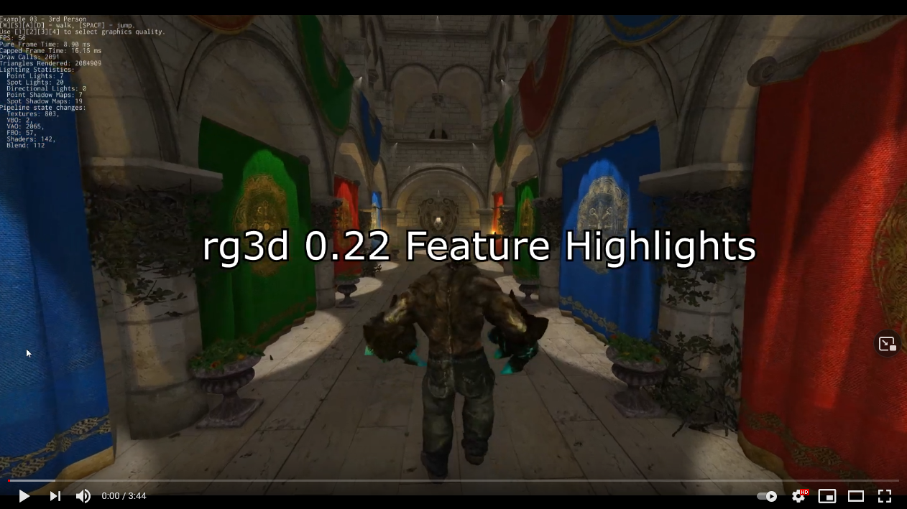

# Rust Game engine 3D (and 2D)

 
A feature-rich, production-ready, general purpose 2D/3D game engine written in Rust with a scene editor.

## Support

If you want to support the development of the project, click the link below. I'm working on the project full time and
use my savings to drive development forward, I'm looking for any financial support. 

## Community

[Join the Discord server](https://discord.gg/xENF5Uh)

## Features

### General

- Exceptional safety, reliability, and speed.
- PC (Windows, Linux, macOS) and [Web (WebAssembly) support](https://rg3d.rs/assets/webexample/index.html).
- Modern 3D rendering pipeline.
- Comprehensive [documentation](https://docs.rs/rg3d).
- 2D support.
- [Scene editor](https://github.com/rg3dengine/rusty-editor/).
- Fast iterative compilation.
- Classic object-oriented design.
- Lots of examples.

### Rendering

- Custom shaders, materials, and rendering techniques.
- Physically-based rendering.
- Metallic workflow.
- High dynamic range (HDR) rendering.
- Tone mapping.
- Color grading.
- Auto-exposure.
- Gamma correction.
- Deferred shading.
- Directional light.
- Point lights + shadows.
- Spotlights + shadows.
- Screen-Space Ambient Occlusion (SSAO).
- Soft shadows.
- Volumetric light (spot, point).
- Batching.
- Instancing.
- Fast Approximate Anti-Aliasing (FXAA).
- Normal mapping.
- Parallax mapping.
- Render in texture.
- Forward rendering for transparent objects.
- Sky box.
- Deferred decals.
- Multi-camera rendering.
- Lightmapping.
- Soft particles.
- Fully customizable vertex format.

### Scene

- Multiple scenes.
- Full-featured scene graph.
- Level-of-detail (LOD) support.
- Various scene nodes.
  - Pivot.
  - Camera.
  - Decal.
  - Mesh.
  - Particle system.
  - Sprite.
  - Multilayer terrain.
- Skinning.

### Sound

- [High quality binaural sound with HRTF support](https://github.com/rg3dengine/rg3d/tree/master/rg3d-sound).
- Generic and spatial sound sources.
- Built-in streaming for large sounds.
- Raw samples playback support.
- WAV format support.
- Vorbis/ogg support.
- HRTF support for excellent positioning and binaural effects.
- Reverb effect.

### Serialization

- Powerful serialization system
- Almost every entity of the engine can be serialized
- No need to write your own serialization.

### Animation

- Animation blending state machine - similar to Mecanim in Unity Engine.
- Animation retargetting - allows you to remap animation from one model to another.

### Asset management

- Advanced asset manager.
- Fully asynchronous asset loading.
- PNG, JPG, TGA, DDS, etc. textures.
- FBX models loader.
- WAV, OGG sound formats.
- Compressed textures support (DXT1, DXT3, DTX5).

### Artificial Intelligence (AI)

- A* pathfinder.
- Navmesh.
- Behavior trees.

### User Interface (UI)

- [Advanced node-based UI](https://github.com/mrDIMAS/rg3d/tree/master/rg3d-ui) with lots of widgets.
- More than 32 widgets
- Powerful layout system.
- Full TTF/OTF fonts support.
- Based on message passing.
- Fully customizable.
- GAPI-agnostic.
- OS-agnostic.
- Button widget.
- Border widget.
- Canvas widget.
- Color picker widget.
- Color field widget.
- Check box widget.
- Decorator widget.
- Drop-down list widget.
- Grid widget.
- Image widget.
- List view widget.
- Popup widget.
- Progress bar widget.
- Scroll bar widget.
- Scroll panel widget.
- Scroll viewer widget.
- Stack panel widget.
- Tab control widget.
- Text widget.
- Text box widget.
- Tree widget.
- Window widget.
- File browser widget.
- File selector widget.
- Docking manager widget.
- NumericUpDown widget.
- Vector3<f32> editor widget.
- Menu widget.
- Menu item widget.
- Message box widget.
- Wrap panel widget.
- Curve editor widget.
- User defined widget.

### Physics

- Advanced physics (thanks to the [rapier](https://github.com/dimforge/rapier) physics engine)
- Rigid bodies.
- Rich set of various colliders.
- Joints.
- Ray cast.
- Many other useful features.

## Tutorials

Writing a 3D Shooter using rg3d:
- [#1 Character controller](https://rg3d.rs/tutorials/2021/03/05/tutorial1.html)
- [#2 Weapons](https://rg3d.rs/tutorials/2021/03/09/tutorial2.html)
- [#3 Bots and AI](https://rg3d.rs/tutorials/2021/03/11/tutorial3.html)

Writing a role-playing game using rg3d
- [#1 Character controller](https://rg3d.rs/tutorials/2021/07/09/rpg-tutorial1.html)

## Screenshots

These screenshots are from [Station Iapetus](https://github.com/mrDIMAS/StationIapetus) which is a commercial project
made with the engine.

These screenshots are from [rusty-shooter](https://github.com/mrDIMAS/rusty-shooter) which is a big demo for the engine.

## [Examples](https://github.com/mrDIMAS/rg3d/tree/master/examples)

There are many examples covering various aspects of the engine. Also don't hesitate to create an issue or ask on Discord if you need help!

## [Editor](https://github.com/mrDIMAS/rusty-editor/)

## Contributing

Contributions are very welcome! Feel free to open Issues and Pull Requests.

Check the [good first issue](https://github.com/mrDIMAS/rg3d/issues?q=is%3Aissue+is%3Aopen+label%3A%22good+first+issue%22) label to see where you can help.
